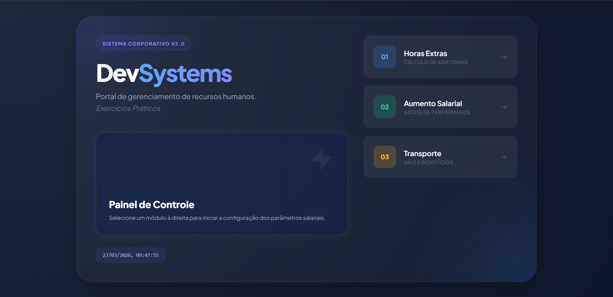
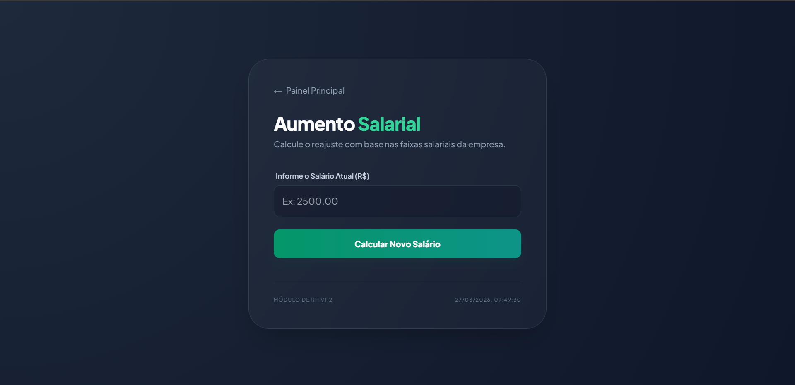
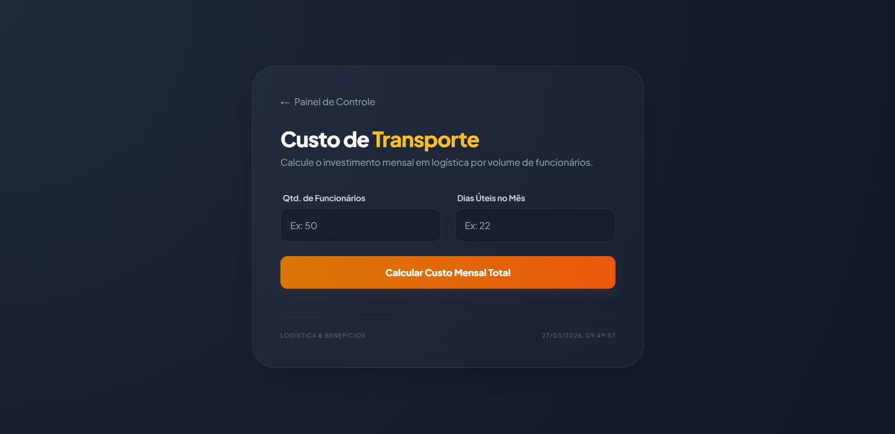

🏢 DevSystems - Portal de Gerenciamento de RH
O DevSystems é uma aplicação interativa desenvolvida para facilitar cálculos essenciais do setor de Recursos Humanos. O projeto centraliza ferramentas de simulação financeira e logística em um painel de controle intuitivo e moderno.

Este repositório contém uma série de exercícios práticos focados em lógica de programação e manipulação de DOM.

🚀 Funcionalidades
O sistema é composto por três módulos principais:

⏱️ Cálculo de Horas Extras: Simulação do valor total a receber com base no salário bruto e distinção entre horas em dias úteis e finais de semana/feriados.
O sistema calcula o valor total a ser recebido pelo colaborador baseando-se no valor da hora comum e acréscimos legais: 
- Valor da Hora Comum: Salário / 200.
- Horas Úteis: Multiplicação direta pelo valor da hora.
- Finais de Semana/Feriados: Acréscimo de 50% sobre o valor da hora.
- Resultado: Soma total das horas normais e extras.

📈 Aumento Salarial: Cálculo de reajuste salarial baseado em faixas de performance e parâmetros da empresa.
O software processa o reajuste automático com base em faixas salariais:
- Até R$ 1.200,00: Aumento de 16%.
- R$ 1.200,01 até R$ 2.100,00: Aumento de 13%.
- R$ 2.100,01 até R$ 3.000,00: Aumento de 10%.
- Acima de R$ 3.000,00: Aumento de 5%.

🚚 Custo de Transporte: Planejamento logístico para calcular o investimento mensal em vale-transporte e benefícios por volume de funcionários.
Calcula o investimento mensal em logística fretada conforme a quantidade de usuários:
- 1 a 49 pessoas: R$ 4,50 por pessoa/dia.
- 50 a 99 pessoas: R$ 4,10 por pessoa/dia.
- 100 a 149 pessoas: R$ 3,80 por pessoa/dia.
- 150 ou mais: R$ 3,60 por pessoa/dia.

🛠️ Tecnologias Utilizadas
O projeto foi construído utilizando uma abordagem "Vanilla", focando na performance e no aprendizado das bases da web:

HTML5: Estrutura semântica dos módulos.
Tailwind CSS: Estilização moderna e responsiva utilizando utilitários.
JavaScript (ES6+): Lógica de cálculo, manipulação de eventos e dinamismo da interface.
VS Code: Ambiente de desenvolvimento.

📂 Estrutura do Projeto
A organização dos arquivos segue uma lógica modular por exercícios:

Plaintext
exercicios/
├── exercicio1/ (Horas Extras)
│   ├── ex1.html
│   └── script.js
├── exercicio2/ (Aumento Salarial)
│   ├── ex2.html
│   └── script.js
├── exercicio3/ (Transporte)
│   ├── ex3.html
│   └── script.js
├── index.html (Painel Principal)
└── wireframe.excalidraw (Planejamento)

🔧 Como Rodar o Projeto
Clone este repositório:

Bash
git clone https://github.com/DanielPupo/JS---exercicio-de-fixacao.git
Abra a pasta do projeto no seu navegador ou utilize a extensão Live Server do VS Code abrindo o arquivo index.html.

Fotos do Projeto:

Desenvolvido com 💻 por Daniel Pupo de Morais Santos